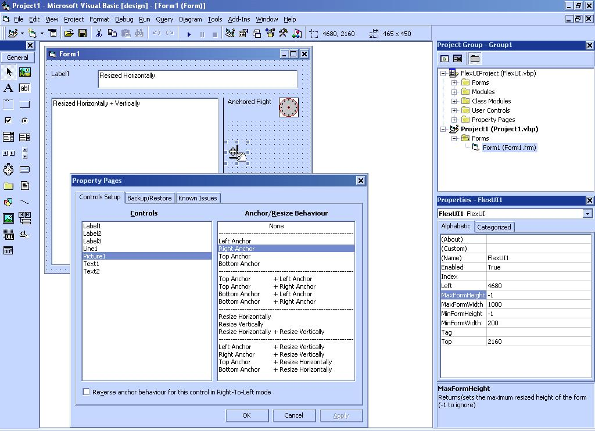



## FlexUI : The ultimate resizer of all time\! v 1\.3

### Description

Stop writting those repetitive resize events. Make your forms resizable with absolutely no code. Throw in this lightweight OCX and let it do the anchoring and resizing of your form controls based on the behaviour you specify.

Features include:

* 15 combination of anchoring and resizing styles. Goes beyond what is available in Visual Studio .NET

* Support for RightToLeft mode (reverses the behaviour you specify when the form is changed to RightToLeft)

* Optional minumum and maximum height and width for the form (uses subclassing to achieve that)

* Function to center the form on screen

* Backup/restore your controls' style configuration to/from a file

* Takes up very little memory resources

I'm always looking forward to enhancing this control based on your suggestions. And please VOTE if you use or recommend this OCX.

----

Updated v1.3 9/29/04

* Changed subclassing to be in the usercontrol instead of a seperate module (thanks Paul Caton!)

* Eliminated the two lines neccessary to activate and call the resize method of the control (again using subclassing)

* Added a function to center form on the screen

* Made MinFormWidth and MinFormHeight have default values equal to the size of the form when the control is created

----

Updated v1.2 9/19/04

* Added a help file to the package

----

Updated v1.2 9/16/04

* Added support for runtime-created controls. To set a style for such a control, call SetControlStyle method after you dynamically create a control

----

Updated v1.1 9/16/04

* Added max form size properties

* Made min and max form size imposing use form subclassing instead of traditional form.Height and form.Width
 
### More Info
 

             |
---                |---
**Submitted On**   |2004-09-26 01:13:54
**By**             |[Alaeddin Hallak](https://github.com/Planet-Source-Code/PSCIndex/blob/master/ByAuthor/alaeddin-hallak.md)
**Level**          |Advanced
**User Rating**    |5.0 (99 globes from 20 users)
**Compatibility**  |VB 6\.0
**Category**       |[OLE/ COM/ DCOM/ Active\-X](https://github.com/Planet-Source-Code/PSCIndex/blob/master/ByCategory/ole-com-dcom-active-x__1-29.md)
**World**          |[Visual Basic](https://github.com/Planet-Source-Code/PSCIndex/blob/master/ByWorld/visual-basic.md)
**Archive File**   |[FlexUI\_\_\_T1798739292004\.zip](https://github.com/Planet-Source-Code/alaeddin-hallak-flexui-the-ultimate-resizer-of-all-time-v-1-3__1-56199/archive/master.zip)

